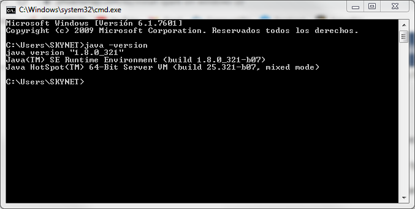
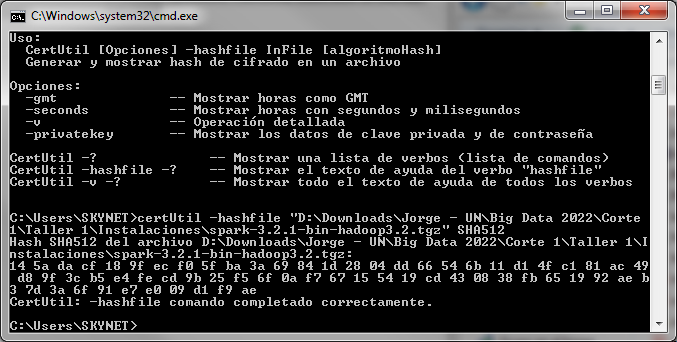
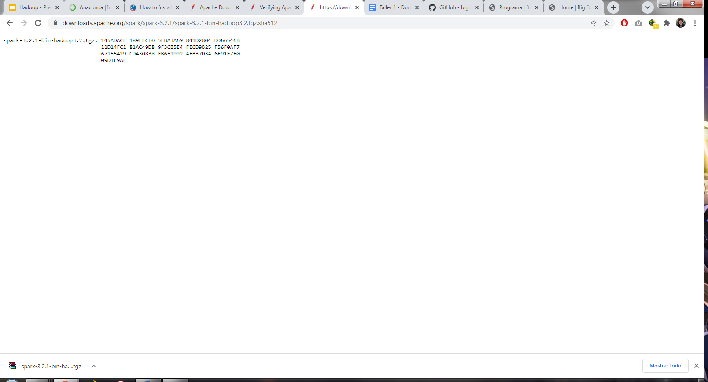
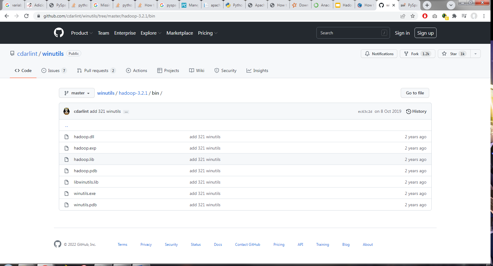
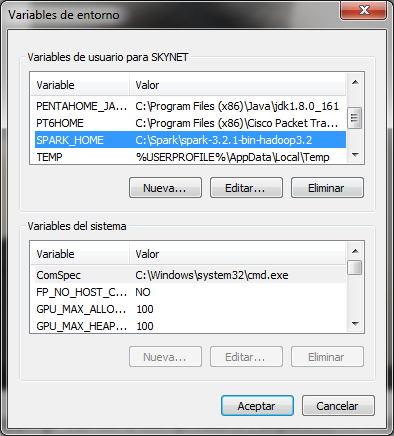
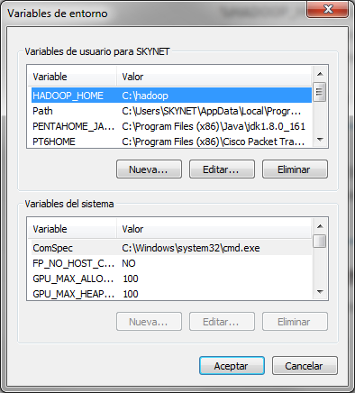
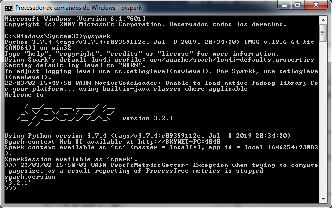
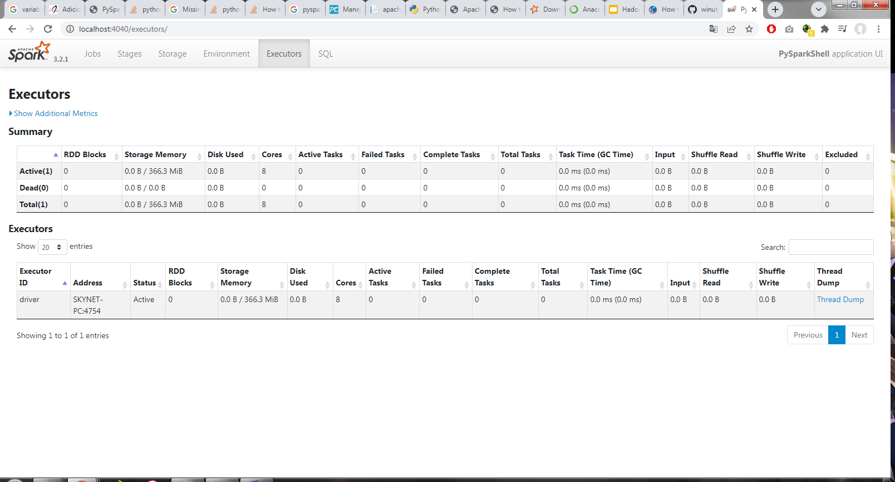
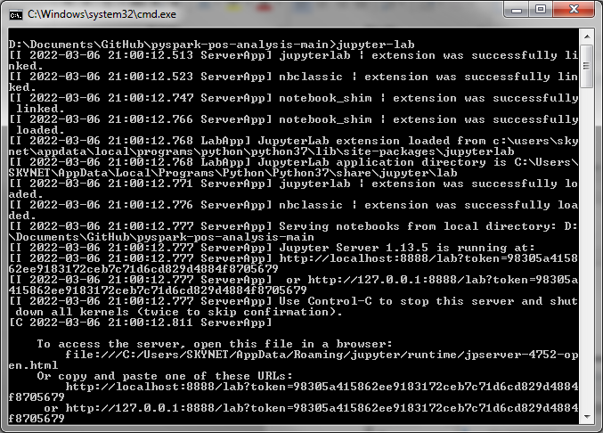
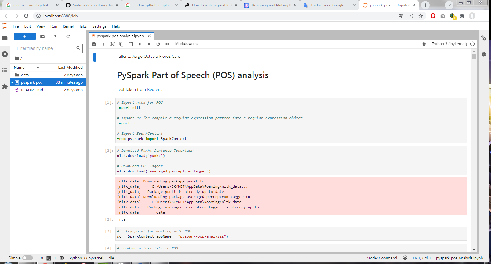

# pyspark-pos-analysis
Code to perform tokenization and POS identification of each word of a text file, using MapReduce to create the main file processing flow and the NLTK library for text analysis.

## Table of Contents
 - [Requirements](#requirements).
 - [Installation](#installation).
 - [Usage](#usage).
 - [References](#references).
 - [Author](#author).
 

## Requirements
 - Java - version 7 and 11.
 - Python - version 3.7.
 - Spark - version 3.2.
 - Hadoop - version 2.7.
 - Jupyter Lab - version 3.3.
	

## Installation
 1. Check the version of JAVA that is installed or install it if you do not have it.
 
 

 2. Download and verify the version of Spark according to the version of Python that is installed (here the integrity of the file is verified).
 
 
 
 
 3. Download the version of winutils.exe according to the version of Spark previously downloaded.
 
 
 
 4. Check or create environment variables for Python, Spark, Hadoop, if they don't exist.
 
  
  

 5. Run Spark and verify it in the browser.
 
  
  

 6. Run Jupyter Lab and use it in the browser.
 
  
  
	
	
## Usage
 - During the development in Jupyter Labs, an exception was being presented in Java that was only solved by changing the version of Hadoop (from 3.2 to 2.7, with the corresponding version change of the winutils.exe file).
 - The video evidence of the correct functioning of each of the requested requirements can be found in the following [link](https://youtu.be/kpLrt0SSHxc).
	
	
## References
 - POS list was based on information from [this forum](https://stackoverflow.com/questions/66613869/how-do-i-count-pos-tags-using-pyspark-and-nltk).

## Author
 - Jorge Octavio Florez Caro.
	
